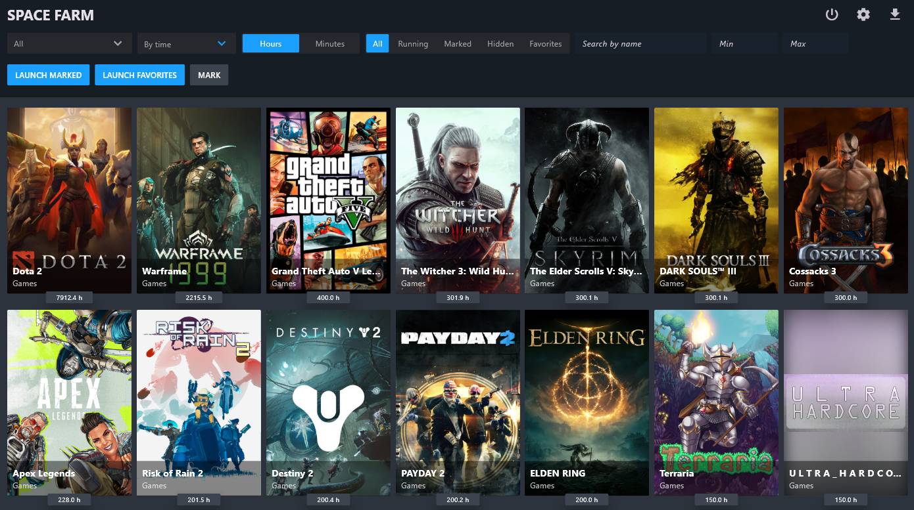

# Space Farm

**Space Farm** is a desktop Flutter app for conveniently managing your Steam library and simulating playtime.

## 🔧 Features

- 🧩 Load game data via:
  - Steam API Key + SteamID
  - Steam login and password (including hidden, private, and Steam Family games)
- 🕹️ Launch games using the local Steam client
- ⭐ Add to favorites and set time goals
- 🗂️ Filtering and sorting:
  - By name, AppID, type, or launch status
  - Sort by time, alphabetically, or by last launch date
- 🖼️ Switch between card views: **Library / Header / Icon**
- 🌍 Multilingual support (you can add your own language if missing)
- 📦 Batch launching:
  - Up to 32 games with automatic stopping when time is reached
  - Automatically switch to the next game in queue
- ✏️ Edit playtime, copy AppID, and hide games
- ⚠️ **HARD STOP** — forcefully terminates all Steam-related processes
- 💾 Cache data in local JSON files

## 🚫 Steam Limitations

> Steam only tracks playtime in **32 games at once**. All others are ignored.  
> Space Farm manages the queue to ensure your playtime progress is recorded without loss.

## 📥 Installation

1. [Download the latest release](https://github.com/CarapacikSpace/SpaceSteamFarm/releases/latest)
2. Extract the archive
3. Run `SpaceFarm.exe`

## 💬 Feedback & Community

Have suggestions, questions, or feedback? Join the discussion and share your ideas here:  
[💬 Discord server](https://discord.gg/Wy78VE6mdq)
