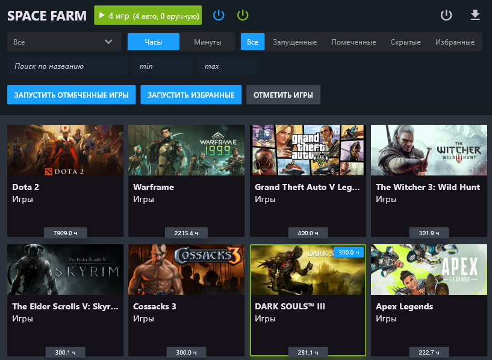

# Space Farm

**Space Farm** — это десктопное приложение на Flutter для удобного управления Steam-библиотекой и накрутки игрового времени.

## 🔧 Возможности

- 🧩 Загрузка информации об играх через:
  - Steam API Key + SteamID
  - Логин и пароль Steam (включая скрытые, приватные и Steam Family игры)
- 🕹️ Запуск игр через локальный Steam-клиент
- ⭐ Добавление в избранное, установка целей по времени
- 🗂️ Фильтрация и сортировка:
  - По названию, AppID, типу, статусу запуска
  - Сортировка по времени, алфавиту и дате последнего запуска
- 🖼️ Переключение вида карточек: **Library / Header / Icon**
- 🌍 Поддержка нескольких языков (если вашего языка нет — его можно добавить)
- 📦 Пакетный запуск:
  - До 32 игр с автоостановкой при достижении заданного времени
  - Автоматическое переключение на следующую игру
- ✏️ Редактирование времени, копирование AppID, скрытие игр
- ⚠️ **HARD STOP** — завершение всех Steam-процессов
- 💾 Кэширование данных в локальные JSON-файлы

## 🚫 Ограничения Steam

> Steam засчитывает игровое время только в **32 играх одновременно**. Остальные — игнорируются.  
> Space Farm автоматически управляет запуском, чтобы сохранить прогресс и обойти это ограничение.

## 📥 Установка

1. [Скачать последнюю версию](https://github.com/CarapacikSpace/SpaceSteamFarm/releases/latest)
2. Разархивировать архив
3. Запустить `SpaceFarm.exe`

## 💬 Обсуждение и предложения

Если у вас есть идеи, пожелания или вы хотите задать вопрос — присоединяйтесь к нашему сообществу:  
[💬 Discord-сервер](https://discord.gg/Wy78VE6mdq)
